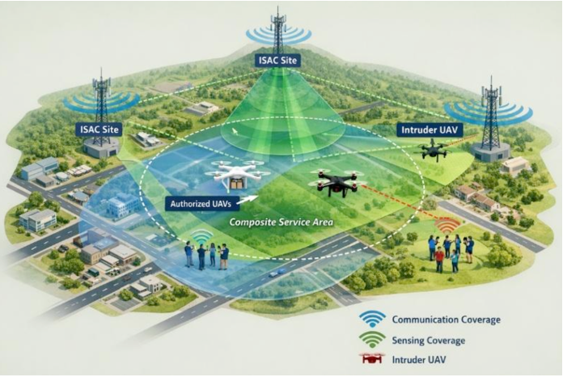
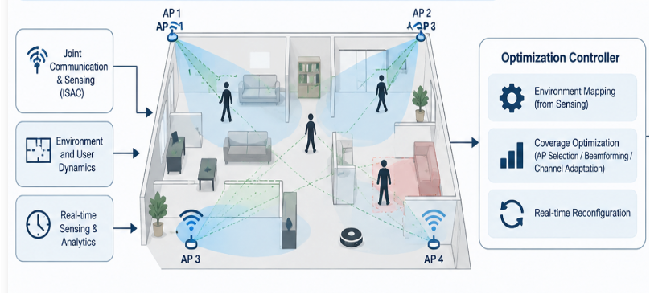
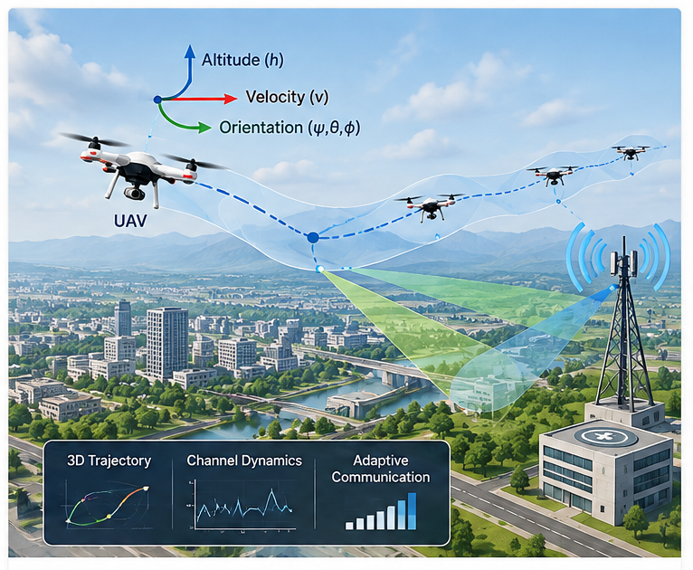

My research focuses on wireless communication and sensing systems, with particular emphasis on Integrated Sensing and Communication (ISAC), aerial networks, and adaptive wireless systems.

Current Research

ISAC · Aerial Networks

<h2>Multi-Static ISAC for Low-Altitude Networks</h2>

Multi-static Integrated Sensing and Communication architectures for low-altitude networks, focusing on distributed sensing, dynamic resource allocation, node role management, and UAV-aware communication and sensing.

ISAC · Wi-Fi

<h2>ISAC-Assisted Dynamic Indoor Wi-Fi Coverage</h2>

ISAC-based environmental awareness for adaptive indoor wireless networks, enabling real-time sensing of user and environmental dynamics to support coverage optimization and seamless connectivity.

UAV · Aerial Communications

<h2>Flight-Dynamics-Aware Aerial Communications</h2>

Adaptive wireless communication for UAV networks considering flight dynamics, mobility, channel variability, and real-time link conditions to enable reliable aerial connectivity.

